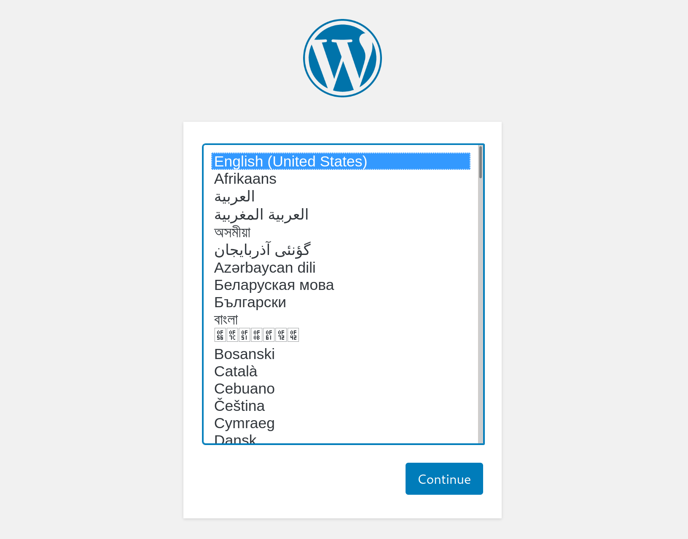

# Web Enumeration

При выполнении сканирования служб мы часто сталкиваемся с веб-серверами, работающими на портах 80 и 443. На веб-серверах размещаются веб-приложения \(иногда более одного\), которые часто обеспечивают значительную поверхность для атак и являются очень важной целью во время теста на проникновение. Правильное перечисление веб-сайтов имеет решающее значение, особенно когда организация не предоставляет много сервисов или эти сервисы исправлены надлежащим образом.

## Gobuster

После обнаружения веб-приложения всегда стоит проверить, можем ли мы обнаружить какие-либо скрытые файлы или каталоги на веб-сервере, которые не предназначены для общего доступа. Мы можем использовать такой инструмент, как [ffuf](https://github.com/ffuf/ffuf) или [GoBuster](https://github.com/OJ/gobuster), чтобы выполнить перечисление этого каталога. Иногда мы обнаруживаем скрытые функции или страницы / каталоги, раскрывающие конфиденциальные данные, которые можно использовать для доступа к веб-приложению или даже для удаленного выполнения кода на самом веб-сервере.

### **Directory/File Enumeration**

GoBuster - это универсальный инструмент, который позволяет выполнять перебор DNS, виртуальных хостов и каталогов. Инструмент имеет дополнительные функции, такие как перечисление общедоступных сегментов AWS S3. Для целей этого модуля нас интересуют режимы перебора каталогов \(и файлов\), указанные с помощью переключателя dir. Давайте запустим простое сканирование, используя список слов dirb common.txt.

```bash
spike@htb[/htb]$ gobuster dir -u http://10.10.10.121/ -w /usr/share/dirb/wordlists/common.txt

===============================================================
Gobuster v3.0.1
by OJ Reeves (@TheColonial) & Christian Mehlmauer (@_FireFart_)
===============================================================
[+] Url:            http://10.10.10.121/
[+] Threads:        10
[+] Wordlist:       /usr/share/dirb/wordlists/common.txt
[+] Status codes:   200,204,301,302,307,401,403
[+] User Agent:     gobuster/3.0.1
[+] Timeout:        10s
===============================================================
2020/12/11 21:47:25 Starting gobuster
===============================================================
/.hta (Status: 403)
/.htpasswd (Status: 403)
/.htaccess (Status: 403)
/index.php (Status: 200)
/server-status (Status: 403)
/wordpress (Status: 301)
===============================================================
2020/12/11 21:47:46 Finished
===============================================================
```

Код состояния HTTP 200 показывает, что запрос ресурса был успешным, а код состояния 403 HTTP указывает, что нам запрещен доступ к ресурсу. Код состояния 301 указывает на то, что нас перенаправляют, что не является ошибкой. Стоит ознакомиться с различными кодами состояния HTTP, которые можно найти [здесь](https://en.wikipedia.org/wiki/List_of_HTTP_status_codes). Модуль Академии веб-запросов также более подробно описывает коды состояния HTTP.

Сканирование было успешно завершено, и оно определяет установку WordPress в / wordpress. WordPress - наиболее часто используемая CMS \(система управления контентом\) и имеет огромную потенциальную поверхность для атак. В этом случае посещение [http://10.10.10.121/wordpress](http://10.10.10.121/wordpress) в браузере показывает, что WordPress все еще находится в режиме настройки, что позволит нам получить удаленное выполнение кода \(RCE\) на сервере.



### **DNS Subdomain Enumeration**

Также могут быть важные ресурсы, размещенные на поддоменах, такие как административные панели или приложения с дополнительными функциями, которые могут быть использованы. Мы можем использовать GoBuster для перечисления доступных поддоменов данного домена, используя флаг dns для указания режима DNS. Во-первых, давайте клонируем репозиторий SecLists GitHub, который содержит множество полезных списков для фаззинга и эксплуатации:

#### **Install SecLists**

```bash
spike@htb[/htb]$ git clone https://github.com/danielmiessler/SecLists
```

```bash
spike@htb[/htb]$ sudo apt install seclists -y
```

Затем добавьте DNS-сервер, например 1.1.1.1, в файл /etc/resolv.conf. Мы настроим таргетинг на домен inlanefreight.com, сайт вымышленной транспортно-логистической компании.

```bash
spike@htb[/htb]$ gobuster dns -d inlanefreight.com -w /usr/share/SecLists/Discovery/DNS/namelist.txt

===============================================================
Gobuster v3.0.1
by OJ Reeves (@TheColonial) & Christian Mehlmauer (@_FireFart_)
===============================================================
[+] Domain:     inlanefreight.com
[+] Threads:    10
[+] Timeout:    1s
[+] Wordlist:   /usr/share/SecLists/Discovery/DNS/namelist.txt
===============================================================
2020/12/17 23:08:55 Starting gobuster
===============================================================
Found: blog.inlanefreight.com
Found: customer.inlanefreight.com
Found: my.inlanefreight.com
Found: ns1.inlanefreight.com
Found: ns2.inlanefreight.com
Found: ns3.inlanefreight.com
===============================================================
2020/12/17 23:10:34 Finished
===============================================================
```

Это сканирование выявляет несколько интересных поддоменов, которые мы могли бы изучить дальше. Модуль [Атака веб-приложений с помощью Ffuf](https://academy.hackthebox.eu/module/details/54) дает более подробную информацию о веб-перечислении и фаззинге.

## Web Enumeration Tips

Давайте рассмотрим несколько дополнительных советов по веб-перечислению, которые помогут решить машины на HTB и в реальном мире.

### **Banner Grabbing / Web Server Headers**

В последнем разделе мы обсудили захват баннеров для общих целей. Заголовки веб-сервера дают хорошее представление о том, что размещено на веб-сервере. Они могут выявить конкретную используемую структуру приложения, параметры аутентификации, а также указать, отсутствуют ли на сервере важные параметры безопасности или он был неправильно настроен. Мы можем использовать cURL для получения информации заголовка сервера из командной строки. cURL - еще одно важный инструмент для тестирования на проникновение, и мы рекомендуем познакомится с его многочисленными опциями.

```bash
spike@htb[/htb]$ curl -IL https://www.inlanefreight.com

HTTP/1.1 200 OK
Date: Fri, 18 Dec 2020 22:24:05 GMT
Server: Apache/2.4.29 (Ubuntu)
Link: <https://www.inlanefreight.com/index.php/wp-json/>; rel="https://api.w.org/"
Link: <https://www.inlanefreight.com/>; rel=shortlink
Content-Type: text/html; charset=UTF-8
```

Еще один удобный инструмент - [EyeWitness](https://github.com/FortyNorthSecurity/EyeWitness), который можно использовать для создания снимков экрана целевых веб-приложений, их отпечатков и определения возможных учетных данных по умолчанию.

### **Whatweb**

Мы можем извлечь версию веб-серверов, поддерживающих фреймворков и приложений с помощью инструмента командной строки _whatweb_. Эта информация может помочь нам определить используемые технологии и начать поиск потенциальных уязвимостей.

```bash
spike@htb[/htb]$ whatweb 10.10.10.121

http://10.10.10.121 [200 OK] Apache[2.4.41], Country[RESERVED][ZZ], Email[license@php.net], HTTPServer[Ubuntu Linux][Apache/2.4.41 (Ubuntu)], IP[10.10.10.121], Title[PHP 7.4.3 - phpinfo()]
```

Whatweb - удобный инструмент, содержащий множество функций для автоматизации перечисления веб-приложений в сети.

```bash
spike@htb[/htb]$ whatweb --no-errors 10.10.10.0/24

http://10.10.10.11 [200 OK] Country[RESERVED][ZZ], HTTPServer[nginx/1.14.1], IP[10.10.10.11], PoweredBy[Red,nginx], Title[Test Page for the Nginx HTTP Server on Red Hat Enterprise Linux], nginx[1.14.1]
http://10.10.10.100 [200 OK] Apache[2.4.41], Country[RESERVED][ZZ], HTTPServer[Ubuntu Linux][Apache/2.4.41 (Ubuntu)], IP[10.10.10.100], Title[File Sharing Service]
http://10.10.10.121 [200 OK] Apache[2.4.41], Country[RESERVED][ZZ], Email[license@php.net], HTTPServer[Ubuntu Linux][Apache/2.4.41 (Ubuntu)], IP[10.10.10.121], Title[PHP 7.4.3 - phpinfo()]
http://10.10.10.247 [200 OK] Bootstrap, Country[RESERVED][ZZ], Email[contact@cross-fit.htb], Frame, HTML5, HTTPServer[OpenBSD httpd], IP[10.10.10.247], JQuery[3.3.1], PHP[7.4.12], Script, Title[Fine Wines], X-Powered-By[PHP/7.4.12], X-UA-Compatible[ie=edge]
```

### **Certificates**

Сертификаты SSL / TLS - еще один потенциально ценный источник информации при использовании HTTPS. Перейдя по адресу [https://10.10.10.121/](https://10.10.10.121/) и просмотрев сертификат, вы увидите приведенную ниже информацию, включая адрес электронной почты и название компании. Они потенциально могут быть использованы для проведения фишинг-атаки, если это находится в рамках оценки.


### **Robots.txt**

Обычно веб-сайты содержат файл robots.txt, целью которого является указание поисковым роботам, таким как робот Google, о том, какие ресурсы можно и нельзя использовать для индексации. Файл robots.txt может предоставить ценную информацию, такую как расположение личных файлов и страниц администратора. В этом случае мы видим, что файл robots.txt содержит две запрещенные записи.


Переход к [http://10.10.10.121/private](http://10.10.10.121/private) в браузере открывает страницу входа администратора HTB.


### **Source Code**

Также стоит проверить исходный код любых веб-страниц, с которыми мы сталкиваемся. Мы можем нажать \[CTRL + U\], чтобы открыть окно исходного кода в браузере. В этом примере показан комментарий разработчика, содержащий учетные данные для тестовой учетной записи, которые можно использовать для входа на веб-сайт.


